

  

  <h1 align="center">CourierApp </h1>

  

    The project was created for an engineering thesis at the University of Warmia and Mazury in Olsztyn.
     
    
  

 

## About the project
This is a project of a delivery management system for a courier company. The system consists of:
* database,
* web API,
* web application,
* mobile application.

  It facilitates the handling of pickup, delivery and return processes of shipments. The web application is designed for three user groups: Customer, Dispatcher and Administrator. 
  Customers can register orders containing any number of shipments they wish to send. Dispatchers assign Couriers to shipments awaiting pickup, return to sender or delivery to recipient. 
  The Administrator manages employees and shipment prices. The mobile application is designed for Couriers. Its main task is to convieniently manage the statuses of shipments in the system. 
  It has a barcode reader function for reading data from parcel labels. The web API manages communication between applications and the database and ensures security of user data.

## Built with
 [![Dotnet][DotnetCore]][Dotnet-url]
 [![CSharp][CSharpLogo]][CSharp-url] 
 [![Vue][Vue.js]][Vue-url] 
 [![Typescript][TypeScript]][TypeScript-url]
 [![MAUI][DotnetMAUI]][DotnetMAUI-url]
 [![MSSQL][MSSQLServer]][MSSQLServer-url]

[linkedin-shield]: https://img.shields.io/badge/-LinkedIn-black.svg?style=for-the-badge&logo=linkedin&colorB=555
[linkedin-url]: https://linkedin.com/in/othneildrew

[DotnetCore]: https://img.shields.io/badge/.NET_Core-5C2D91?style=for-the-badge&logo=.net&logoColor=white
[Dotnet-url]: https://learn.microsoft.com/en-us/aspnet/core/?view=aspnetcore-7.0
[Vue.js]: https://img.shields.io/badge/Vue.js-35495E?style=for-the-badge&logo=vuedotjs&logoColor=4FC08D
[Vue-url]: https://vuejs.org/
[CSharpLogo]: https://img.shields.io/badge/C%23-239120?style=for-the-badge&logo=csharp&logoColor=white
[CSharp-url]: https://learn.microsoft.com/en-us/dotnet/csharp/
[TypeScript]: https://img.shields.io/badge/TypeScript-007ACC?style=for-the-badge&logo=typescript&logoColor=white
[TypeScript-url]: https://www.typescriptlang.org
[DotnetMAUI]: https://img.shields.io/badge/.NET_MAUI-5C2D91?style=for-the-badge&logo=data:image/png;base64,iVBORw0KGgoAAAANSUhEUgAAAQAAAAEABAMAAACuXLVVAAAAGFBMVEUAAAD29vZRK9T29vajkOXVze+Od+FwUdrZkDGoAAAAAnRSTlMAYDshrGAAAAKdSURBVHja7NvBicMwFITh5w4E7sAH5ywEW8FCKtgG4g5M+mdPy8i+ONYPVjbM3Ad/47Ne/GUsp5JjE94fyskk2gcDNIH0wQBNQH0wQBNIHwzQBNQHAzSB9MEATUB9MEATSB8M0ATU1wAwgfQ1AExAfQ0AE2h/KCCJ9jWgLZn3h4KSaL8e8DW9mKWaQPtRlMf0Yuai0H5sBjRMoP3YDGiYQPtRD2iZQPtRD2iZQPtRDWiaQPtRDWiaAPsCTCdTlKa+AQYY8L6A74McAA77BhhggAEGGGCAAQYYYIABBhhgwL8E3KfGPBFAWVsBNwjQDyC/gAPWdsANAfQDyC/ggJUAbhxwn1CeGLAywA0DJhgDDDDgcwE/uxhggAEGGGCAAZ8D2IcC9jHAAAPeF/C4FjCzJ50csKBHrRwws2e9HLCgh80cMLOn3Ryw1ADlcRVgLkrD834OqJ/3Hx446INnItDxjcfYE5AjYugJSDrT6QLIOnTqA0g61eoCyDp26wNIOtfrAsg6eOwDSNXJZg9ADmXoAUhRZbwekKPOcD0gxSbj1YAc2wxXA1LsMl4LyPFugN/27u0EQiCIgujmsPnnagqCMucK5b9Q4mO6W6/FTwG4CLduQ/IgWnoUo8VoZzlmBclKSQaL0o2ynDYmC60Zbk59e84HFHxEMzSkOjqmWxxUHh7V7g2r+biev7AIIIAAZgD4BwwBBBBAAAEEEMBnAHjAIYAAAri7fT/wyCOfPPTqY788+Oyj3zz87uP//AcIAQQQQAABBBBAAAEEEEAAAQQQwKsA+wKFAAII4BTAnlCJK6W4VMtrxbhYzavljFzP6wW5YJErJr1kk2tGvWiVq2a9bJfrhr1wmSunvXSba8e9eJ2r5718//d/cABP9r8ABmVt9Rqvi1MAAAAASUVORK5CYII=
[DotnetMAUI-url]: https://learn.microsoft.com/pl-pl/dotnet/maui/?view=net-maui-7.0
[MSSQLServer]: https://img.shields.io/badge/Microsoft%20SQL%20Server-CC2927?style=for-the-badge&logo=microsoft%20sql%20server&logoColor=white
[MSSQLServer-url]: https://www.microsoft.com/en-us/sql-server

## Screenshots

### Mobile application

  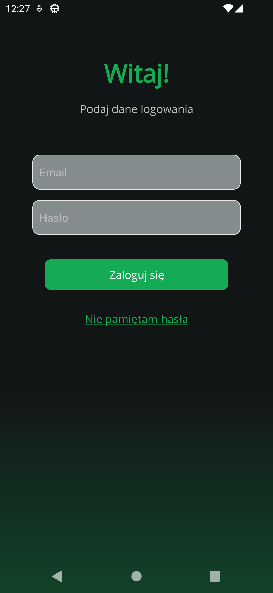 &nbsp;
  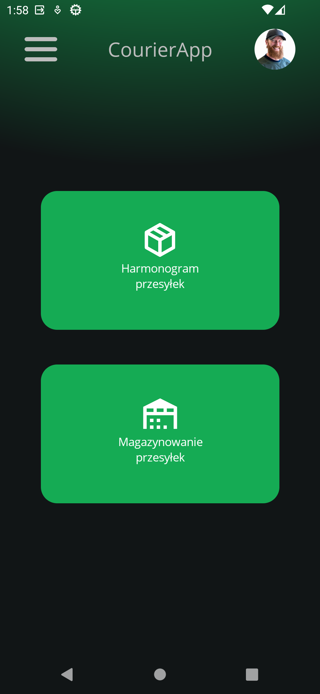
   &nbsp;
  
  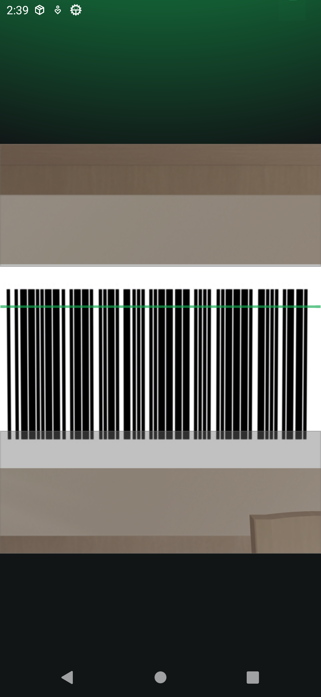

### Web application

#### Customer

  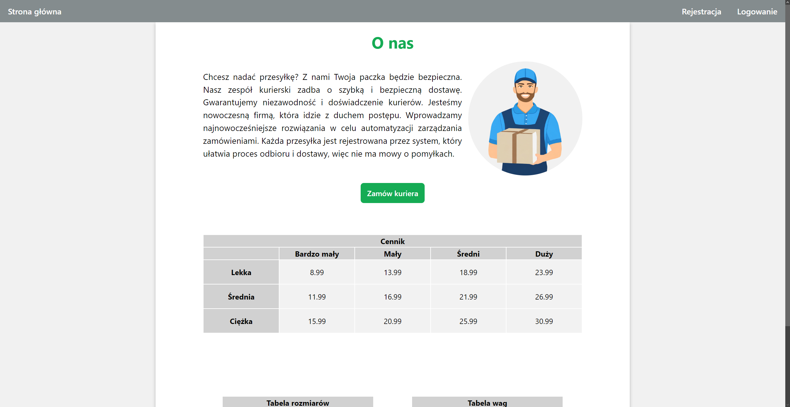
  
  *Home page*

  
    
  *Login page*

  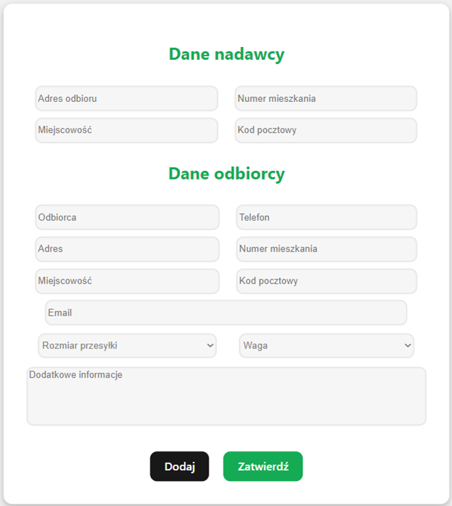
    
  *Order page*

  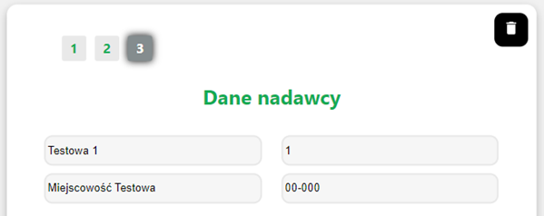
    
  *Multiple shipments in one order*

  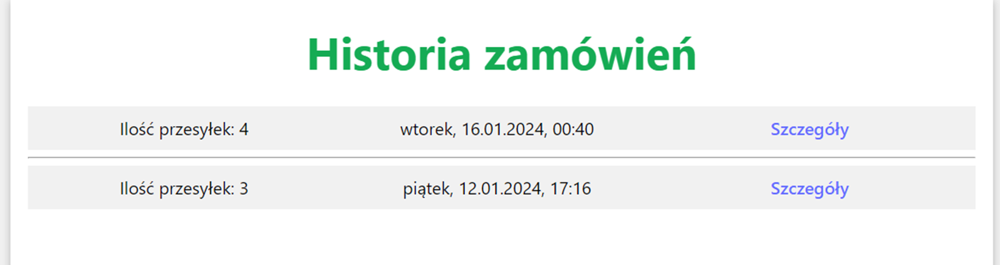
    
  *Orders archive*

  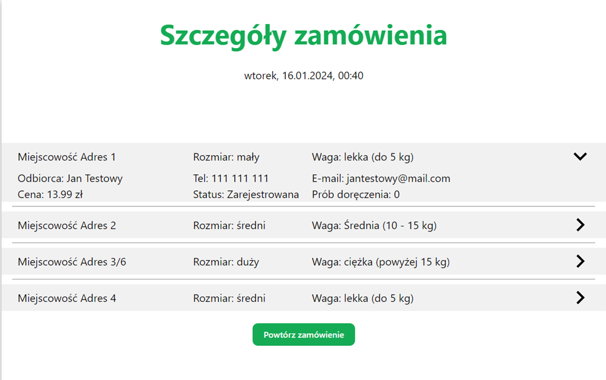
    
  *Order details*

#### Admin

  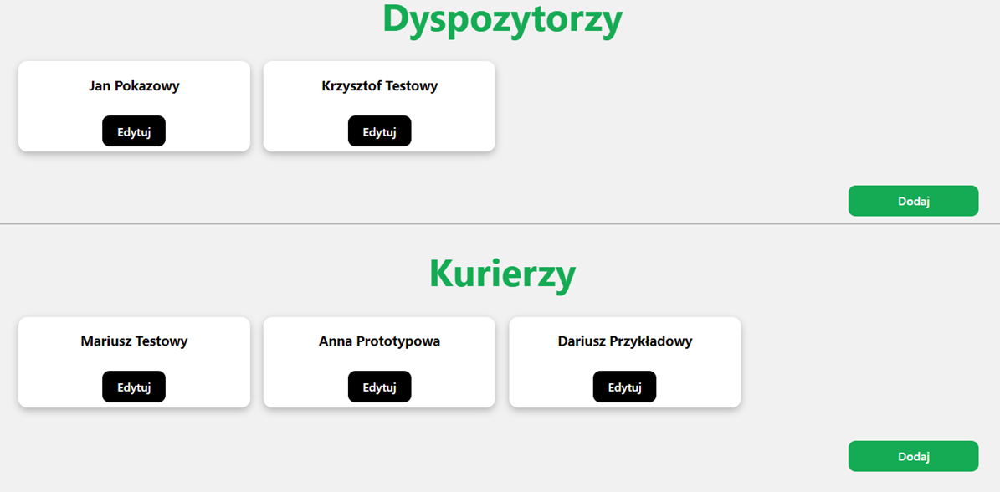
    
  *Admin page*

  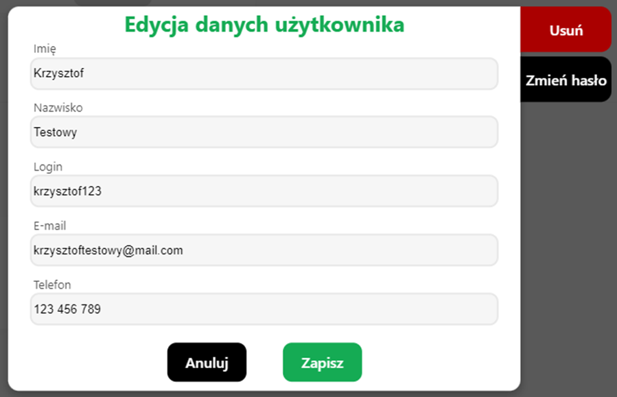
    
  *Edit worker data*

#### Dispatcher

  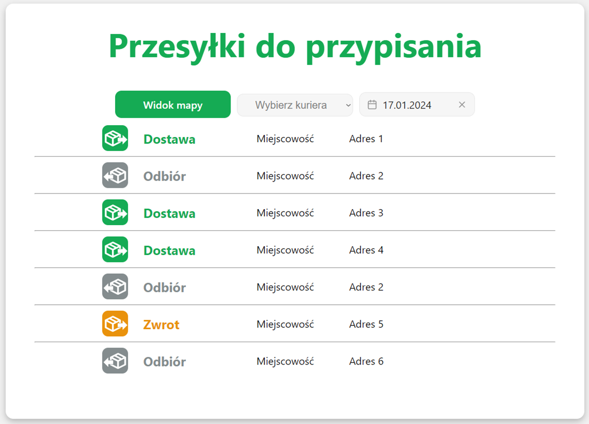
    
  *Awaiting shipments list*

  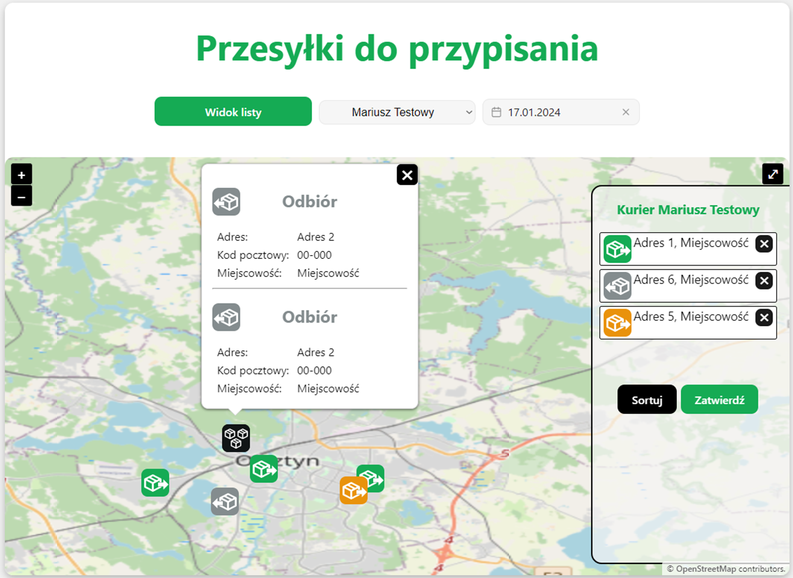
    
  *Asigning route to courier*

  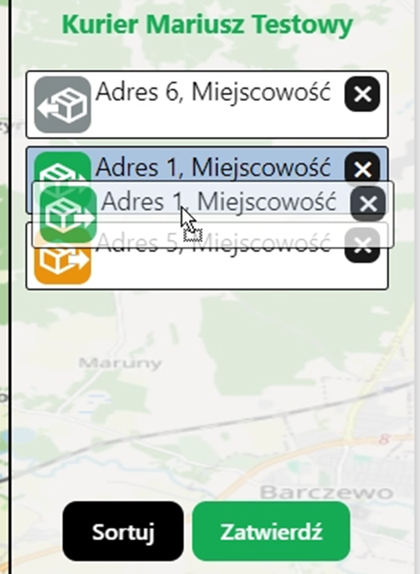
    
  *Sorting route*

  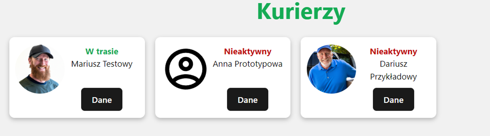
    
  *Couriers list*

